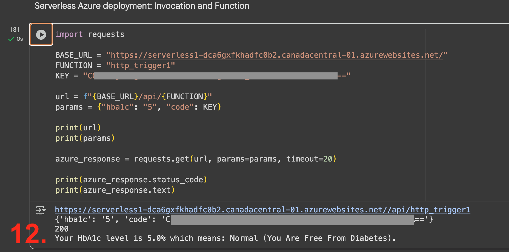
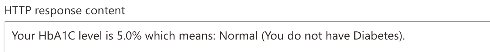

# Azure Function

## Creation

<details>
<summary>Create</summary>


<br />


<br />


<br />


<br />


<br />


<br />


<br />


<br />


<br />


</details>
<br />

## Validation and Invocation

<details>
<summary>Validate</summary>

<br />


<br />


<br />



<br />

> #13 was feeling unlucky!

<br />


<br />

**Google Colab: Azure Invocation Code**

```bash
import requests

BASE_URL = "https://serverless1-dca6gxfkhadfc0b2.canadacentral-01.azurewebsites.net/"
FUNCTION = "http_trigger1"
KEY = "enter auto generated key here"

url = f"{BASE_URL}/api/{FUNCTION}"
params = {"hba1c": "5", "code": KEY}

print(url)
print(params)

azure_response = requests.get(url, params=params, timeout=20)

print(azure_response.status_code)
print(azure_response.text)
```
</details>
<br />

<details>
<summary>Log</summary>

<br />

<br />

</details>
<br />

## Function Run & Test

<details>
<summary>Test</summary>

<br />

> HbA1C = 4


<br />

> HbA1C = 5



<br />

> HbA1C = 6


<br />

> HbA1C = 7


<br />
</details>


