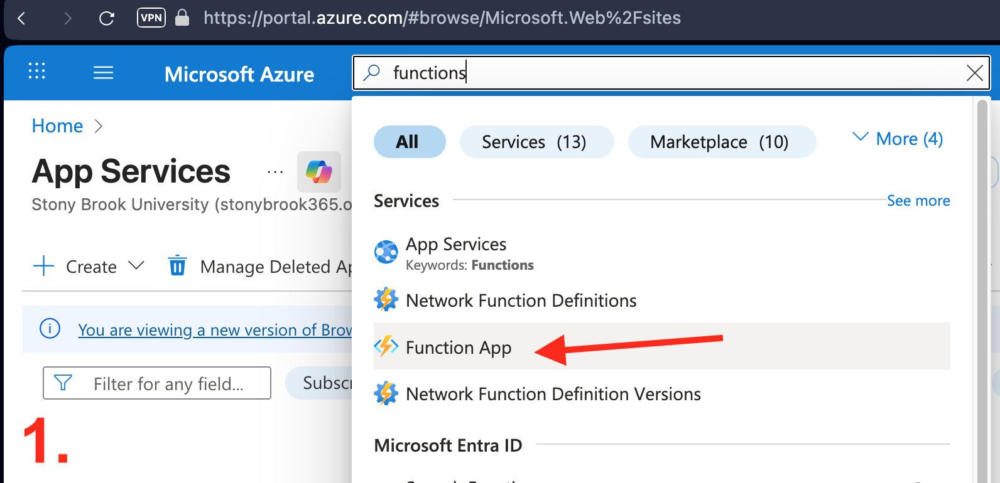
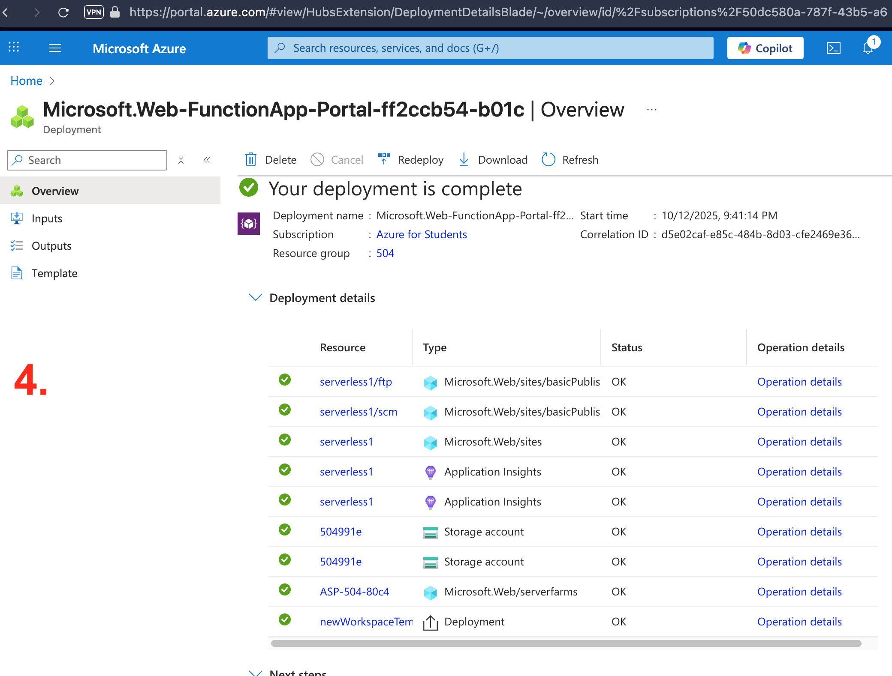
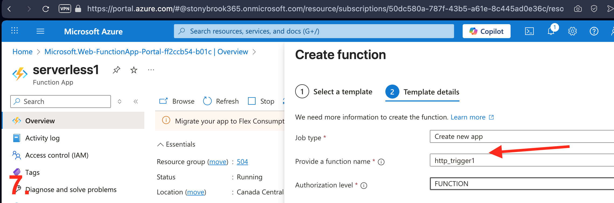
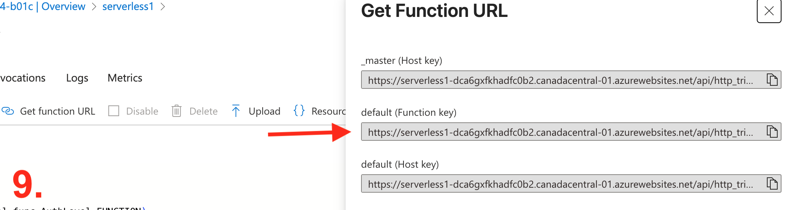
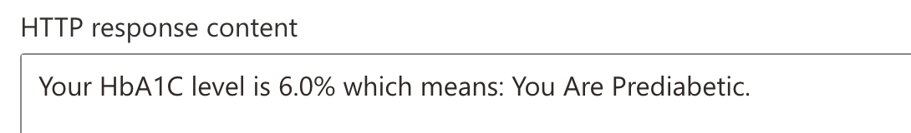

# Azure Function

## Creation

<details>
<summary>Steps</summary>


<br />


<br />


<br />


<br />


<br />


<br />


<br />


<br />


<br />


</details>

<br />

<details>
<summary>Azure Function Code</summary>

<br />

> As partially visible in step 8 of creation steps above 

<br />

```bash
import azure.functions as func
import logging

app = func.FunctionApp(http_auth_level=func.AuthLevel.FUNCTION)

@app.route(route="http_trigger1")
def http_trigger1(req: func.HttpRequest) -> func.HttpResponse:
    logging.info('Python HTTP trigger function processed a request.')

    hba1c_str = req.params.get('hba1c')

    if not hba1c_str:
        try:
            req_body = req.get_json()
            hba1c_str = req_body.get('hba1c')
        except ValueError:
            hba1c_str = None

    try:
        hba1c = float(hba1c_str) if hba1c_str else None
    except ValueError:
        hba1c = None

    if hba1c is not None:
        if hba1c <= 4.0:
            status = "Cause for concern — please see a doctor"
        elif 4.1 <= hba1c <= 5.7:
            status = "Normal (You do not have Diabetes)"
        elif 5.8 <= hba1c <= 6.5:
            status = "You Are Prediabetic"
        else:
            status = "Abnormal (You Have Diabetes)"
        message = f"Your HbA1C level is {hba1c}% which means: {status}."
    else:
        message = (
            "This HTTP triggered function executed successfully. "
            "Enter a 'hba1c' value in the query string or request body to receive an interpretation."
        )

    return func.HttpResponse(message, status_code=200)
```

</details>

<br />

## Validation and Invocation

<details>
<summary>Steps</summary>

<br />


<br />


<br />


<br />


> #13 was feeling unlucky!


<br />


</details>

<br />

<details>
<summary>Google Colab: Azure Invocation Code</summary>

```bash
import requests

BASE_URL = "https://serverless1-dca6gxfkhadfc0b2.canadacentral-01.azurewebsites.net/"
FUNCTION = "http_trigger1"
KEY = "enter auto generated key here"

url = f"{BASE_URL}/api/{FUNCTION}"
params = {"hba1c": "5", "code": KEY}

print(url)
print(params)

azure_response = requests.get(url, params=params, timeout=20)

print(azure_response.status_code)
print(azure_response.text)
```
</details>

<br />

<details>
<summary>Log</summary>

<br />


<br />

</details>
<br />

## Function Run & Test

<details>
<summary>Test</summary>

<br />

> HbA1C = 4


<br />

> HbA1C = 5


<br />

> HbA1C = 6



<br />

> HbA1C = 7


<br />
</details>


