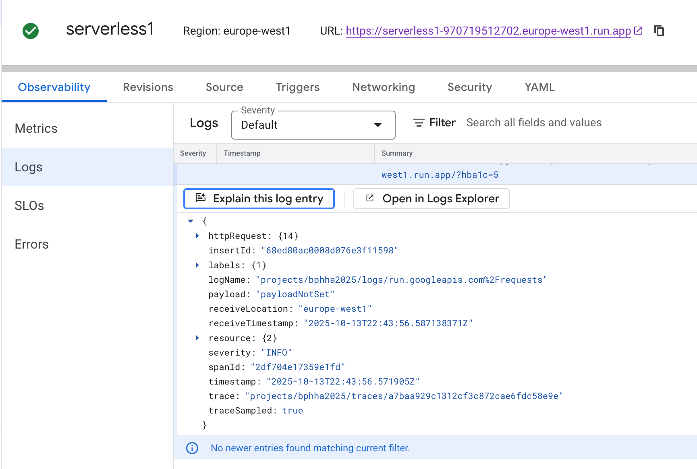

# GCP Function

## Create

<details>
<summary>Steps</summary>

1. Login to a porovisioned Google Cloud Console acct
2. In search bar, search for Functions > select "Cloud Run Functions"
3. Select "Write a function"
4. Select "Use an inline editor to create a function"
    - This s simple function, so docker creation and artifact registry is not needed.
    - Github connection is also not needed.
5. Configure the function to basics for this function: Python, and basic setup.

</details>

## Function code

<details>
<summary>Code</summary>

```bash
import functions_framework

@functions_framework.http
def hba1c(request):
    request_args = request.args
    request_json = request.get_json(silent=True)

    if request_args and 'hba1c' in request_args:
        hba1c_str = request_args['hba1c']
    elif request_json and 'hba1c' in request_json:
        hba1c_str = request_json['hba1c']
    else:
        hba1c_str = None

    try:
        hba1c = float(hba1c_str) if hba1c_str else None
    except ValueError:
        hba1c = None

    if hba1c is not None:
        if hba1c < 5.7:
            status = "NORMAL (You Are Free From Diabetes)"
        elif 5.7 <= hba1c <= 6.4:
            status = "You Are Prediabetic"
        else:
            status = "ABNORMAL (You Have Diabetes)"
        message = f"Your HbA1c level is {hba1c}%. Which means \n{status}"
    else:
        message = (
            "This HTTP triggered function executed successfully.\n"
            "Enter a 'hba1c' value in the query string or request body to receive an interpretation."
        )

    return message
```
</details>

## Test & Deploy

<details>
<summary>Steps</summary>

<br />

> Function Console 

<br />


<br />

> Function Test 

<br />


<br />

> Function CLI Test

<br />


<br />

> URL deployed

<br />


<br />

</details>

## Run & validate

<details>
<summary>Test</summary>

<br />

> GCP CLI run

<br />


<br />

> URL run

<br />


<br />

> Google Colab Run with **REQUESTS INVOCATION CODE**

<br />


</details>

## Monitor

<details>
<summary>Logging</summary>

<br />

> Function log

<br />


<br />

> Logs explorere with Gemini

<br />


<br />

> Recent Logs

<br />



</details>

<br />

<details>
<summary>Monitor & Manage</summary>

<br />

> Synthetic monitoring

<br />


<br />

> YAML mannual configuration

<br />


<br />

> YAML metadata

<br />


<br />

> YAML container data

<br />


<br />

> YAML traffic

<br />


<br />

> Revisions > Account

<br />


<br />

> Observability > Annotations

<br />

 Annotations" width="700">


</details>

<br />


## Security

<details>
<summary>Authentication</summary>

<br />

> Both Azure and GCP have options to authenticate; Where Auzre has it by default, GCP has open-access by default. This can be toggled either way in both.

<br />


</details>